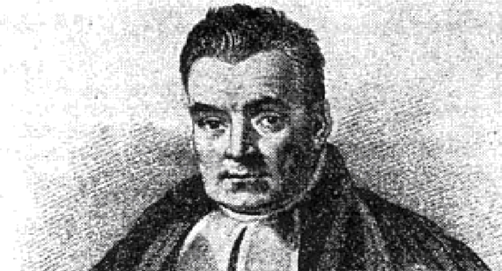
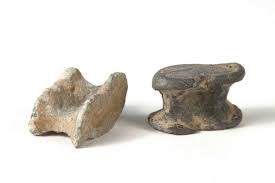
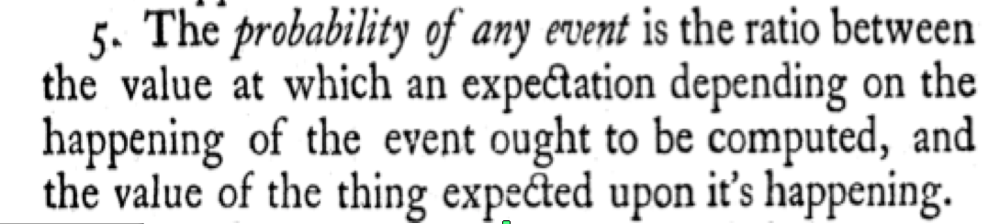
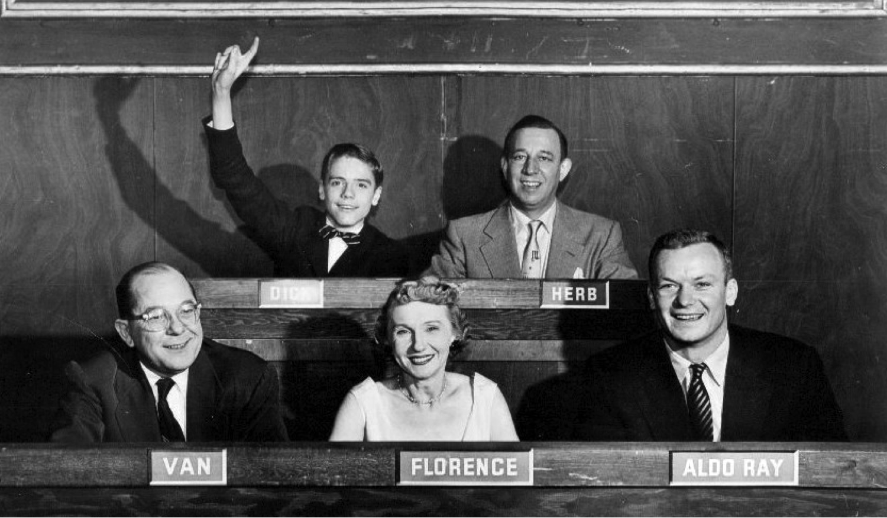

Being Bayesian
========================================================

John Hawkins

Background
========================================================

Early Years of Probability Theory 
- Reasoning about systems with known (or assumed) structure 
  - E.g. Coin tosses, rolls of dice, removing balls from urns

- Calculate the probability of a composite, complex outcome
  - E.g. Probability of rolling two dice that sum to eight or greater
  - Notion of sample spaces, permutations & combinatorics
  

Known System Probabilities?
========================================================

Inferring System Probabilities
========================================================

In classical probability reasoning was from 
  - Known System Properties ==> Probability of Observable States
  
Bayes was part of a shift in reasoning
  - Observed Outcomes ==> Inferred System Properties
  

First Attempt: Bernoulli
========================================================
Jakob Bernoulli also wanted to answer the question of how best to estimate
unknown probabilities.

His focus was drawn to a related question: 

  - Given a system that generates
   binary random variables with a fixed probability $P$. How many observations
   do we need to make in order to estimate $P$ within certain bounds?

Bernoulli's Results
========================================================
Bernoulli's work lead to the Law of Large Numbers

Laying the groundwork for the frequentist approach to estimation and inference
   - Ars Conjectandi

Bernoulli allows us to answers questions like "What is the probability of observing the series of experimental results we see, if there were no difference between treatment and trial?"

Enter Bayes
========================================================
Bayes also wanted to answer the question of how to infer a probability, given a set of observations

He also wanted to be able to reason about our uncertainty

The langauge of probability seemed a natural fit

- Problem: This is not how probability had been defined.

Probability, up until this point, was restricted to random variables 
- Not to fixed but unknown properties of the world.

Bayes Idea 1 - Subjective Probability
========================================================
Bayes needed to redefine probability

As a representation of our degree of confidence that 
a certain outcome would, or would not, occur.

If that sounds like a strange thing to do, just wait until you see how he did it.

Essay Toward Solving a Problem in the Doctrine of Chances
==========================================================

Excerpt
  

Expectation?
==========================================================

We think of an $expectation$ as a sum over the values of the potential
outcomes, multiplied by their respective probabilities.
- Devised by Pascal & Fermat to solve the problem of points.

Bayes inverts this and makes the $expectation$ the fundamental quality, from which probability is derived.
   - If your expectation for an specfic event is E and 
   - The total value of the event is T, 
   - Then the probability of the event is E/T

Bayes Idea 2 - Bayes Rule
========================================================

Sometimes called a theorem, Bayes' rule can be derived from the axioms of probability.

The joint probability of events A & B, P(A,B), is equal to the conditional probability of A given B, multiplied by the probability of B. $P(A|B)P(B)$

It can also be calculated from the inverse: p(B|A)P(A). Which means:$P(A|B)P(B) = p(B|A)P(A)$

Hence

$$
  \begin{aligned}
  P(A|B) = \frac{p(B|A)P(A)}{P(B)}
  \end{aligned}
$$

Are we there yet?
========================================================

Not quite

We have discussed:

- Bayes subjective defintion of probability
- The derivation of Bayes' Rule.

Two more concepts in Being Bayesian
- Assigning a prior.
- Postponing point estimates

Assigning a prior
========================================================

Recall the defintion of Bayes' rule:

$$
  \begin{aligned}
  P(A|B) = \frac{p(B|A)P(A)}{P(B)}
  \end{aligned}
$$

We want to know the probability of A, given we have observed B.

However, we need to know P(A) to begin with

This is a conundrum, how do we proceed when what we want to estimate is something
we need to know in order to make the estimate?

Bayes' answer: have a bloody guess.

Postponing point estimates
========================================================

The entire reason Bayes' gave a subjective definition of probability was so that he could use it to express uncertainty.

Take the real probability $P$ that a coin will come up heads.

In all likelihood it is not exactly $\frac{1}{2}$, but it is fixed, every toss of the coin does not involve a random sample of the underlying probability.

For Bayes, probability represents uncertainty. 
We express our uncertainty about the value of $P$ using a probability distribution

This means, in the absence of complete certainty, our estimate of $P$ remains a
probability distribution.

Putting it together
========================================================

Four elements of Bayesian reasoning

- Subjective Definition of Probability
- Estimating a Prior
- Bayes Rule (from prior to a posteriori)
- Postponing a point estimate

Some examples should illustrate how all of these moving parts come together.
- Contrast with classical or frequntist statistics.

Simple Example
========================================================

A colleague has a coin, 

She has told us that it is either two headed or it is regular.

She flipped the coin and the result was heads.

What is the probability that the coin is regular?

Simple Example: Answer Part I
========================================================

It is important to recognise that for a pure frequestist this question is undefined.

For a Bayesian the answer can be given by applying Bayes' Rule 

$$
  p(RC|H) = \frac{p(H|RC) * p(RC)}{p(H)}
$$

Simple Example: Answer Part II
========================================================

Our *prior* is initial probability of the coin being regular. 
   - $p(RC) = \frac{1}{2}$

The conditional probability of a head given that it is a regular coin.
   - $p(H|RC) = \frac{1}{2}$

The marginal probability of observing a head is $P(H)$ given by:

$$
  p(H) = \sum_{C=(RC,BC)} p(H|C) = ( \frac{1}{2}*\frac{1}{2} ) + (\frac{1}{2} * 1) \\
       = \frac{3}{4}
$$

Simple Example: Answer Part III
========================================================

Putting that together we have:

$$
  p(RC|H) = \frac{p(H|RC) * p(RC)}{p(H)} \\
          = \frac{ \frac{1}{2} * \frac{1}{2} }{\frac{3}{4} } \\
          = \frac{1}{3} 
$$

Alternative Definition
========================================================

This problem can be reworded in such a way that it becomes amenable to Frequentists:

"Someone flips an unbiased coin. If she gets heads she chooses a two headed coin.
If she gets tails she chooses a regular coin. She then tosses the second coin. If she
gets a head on the second toss, what is the probability that the first toss got a tail?"

By making the properties of the unknown coin the result of a well specified random
variable the question becomes a simple exercise in classical probability.

More importantly: **for the Frequentist and the Bayesian the solution is the same**.

Making Predictions
========================================================

The previous solution gave a probability distribution over the identity of the coin 
   - Conditioned on the first observation being a head $(O_1:H)$
   - $P(RC)=\frac{1}{3}$ and  $P(BC)=\frac{2}{3}$

To calculate the probability of the next toss being a head $(O_2:H)$ we take an expectation

$$
  P(O_2:H)= P(RC) * P(O_2:H|RC) + P(BC) * P(O_2:H|BC)\\
          = (\frac{1}{3} * \frac{1}{2}) + ( \frac{2}{3} * 1)\\
          = \frac{5}{6}
$$

Some Observations
========================================================

Although the process used to get to the answer on the previous slide might seem Bayesian
   - We maintain a probability distribution over the identity of the second coin
   - We make use of Bayes rule
   
It is perfectly reasonable to a Frequentist to follow the same line of reasoning because
 **probabilities have only been allocated to random variables**.

Only under the original problem definition is it undefined for the Frequentist.

Interim Conclusions
========================================================

There is a clear distinction between cases when we 
- Use a methodology that looks Bayesian (use of Bayes Rule)
- Use Bayesian Principles (Assign Probabilities to Non-Random Variables)

Bayesian Principles allow us to solve problems that are undefined for Frequentists.

However: Given that we can redefine these problems to make them amenable to Frequentists, 
it is reasonable to ask: **Is this all just sleight of hand???**

Continuous Example
========================================================

Our colleague has a coin that she tells us could be biased anywhere on the
spectrum from always landing heads to always landing tails.

- We denote this unknown bias $\theta$. So $P(H)=\theta$

We observe her throwing the coin 10 times and observe 8 heads and 2 tails.

- What is our estimate of the value of $\theta$?
- What is the probability that $\theta$ is less than or equal to $0.5$?
- What is the probability that the next toss will be heads?

Continuous Example - Frequentist Approach
========================================================

For  a frequentist the answer to the first question is given by the Maximum Likelihood Estimate.
- $\theta=0.8$

For a frequentist the second question is undefined.
- $\theta$ is not a random variable.

The MLE of $\theta$ provides an immediate answer to the third question.
- The probability of the next toss resulting in a head is $0.8$

Continuous Example - Bayesian Approach
========================================================

For a Bayesian the answer begins by assigning a probability distribution over possible values
of $\theta$.

Typically for parameters that are themselves probabilities this is a beta distribution.

- $P(\theta) = Beta(\alpha, \beta) = B(\alpha,\beta)^{-1} \theta^{\alpha-1} (1-\theta)^{\beta-1}$

Where

- $B(\alpha,\beta) = \int_0^1 u^{\alpha-1} (1-u)^{\beta-1} du$

Bayesian Approach II
========================================================

Given any particular value of $\theta$ the probability of the observed data is given 
by the Binomial distribution.

- $P(data|\theta) = {10 \choose 8} \theta^8 (1-\theta)^2$

The marginal probability of the data is given by taking on integral of the joint probability.

$P(data) = \int_0^1 P(data|\theta) \cdot P(\theta)  d\theta$  
   $= \int_0^1 {10 \choose 8} \theta^8 (1-\theta)^2 \cdot B(\alpha,\beta)^{-1} \theta^{\alpha-1} (1-\theta)^{\beta-1} d\theta$
   $= {10 \choose 8} B(\alpha,\beta)^{-1} \int_0^1 \theta^{8+\alpha-1} (1-\theta)^{2+\beta-1} d\theta$

Bayesian Approach III
========================================================

So, the posterior probabilty distribution over $\theta$ is given by

$$
P(\theta|data) = \frac{P(data|\theta) \cdot P(\theta)}{P(data)}
$$

If we substitute in the previous definitions we get.

$$
\frac{{10 \choose 8} \theta^8 (1-\theta)^2 \cdot B(\alpha,\beta)^{-1} \theta^{\alpha-1} (1-\theta)^{\beta-1}} {{10 \choose 8} B(\alpha,\beta)^{-1} \int_0^1 \theta^{8+\alpha-1} (1-\theta)^{2+\beta-1} d\theta}
$$

which simplifies to

$$
\frac{ \theta^{8+\alpha-1} (1-\theta)^{2+\beta-1}} {\int_0^1 \theta^{8+\alpha-1} (1-\theta)^{2+\beta-1} d\theta}
$$

Bayesian Approach IV
========================================================

The denominator should look familiar, because remember that
- $B(\alpha,\beta) = \int_0^1 u^{\alpha-1} (1-u)^{\beta-1} du$

So

$$
P(\theta|data) = B(8+\alpha, 2+\beta)^{-1} \cdot \theta^{8+\alpha-1} (1-\theta)^{2+\beta-1}
$$

Which has the functional form of a new beta distribution.

If we assign a uniform prior $\theta \sim Beta(\alpha=1, \beta=1)$, then

$$
P(\theta|data) = Beta(9,3)
$$

Bayesian Approach V
========================================================

Notice that the final distribution over $\theta$ is the same parametric
distribution with a change in parameters.

- We went from a prior of $Beta(1,1)$ to a posterior of $Beta(9,3)$.

The Beta distribution works with binomial problems in this fashion 
- Known a the conjugate prior for Binomial problems.

Bayesian Approach VI
========================================================

In question 2 we were asked the probability that $\theta$ is less than or equal to $0.5$

As we have a probability distribution over $\theta$, we can easily solve this with an integral

$$
  \int_0^{0.5} P(\theta) d\theta = \int_0^{0.5} Beta(9,3) d\theta \\
  \frac{\int_0^{0.5} \theta^{8} (1-\theta)^{2}  d\theta}{B(9,3)}
$$

Which works out of approximately $0.09$

Bayesian Approach VII
========================================================

In the final question we are asked the probability of the next toss resulting in a head.

This is an expectation which we can again solve with an integral

$$
  \int_0^1 \theta P(\theta) d\theta = \int_0^1 \theta B(9,3)^{-1} \theta^9 (1-\theta)^3 d\theta \\
$$

Which comes to $0.75$

Note: This is also the mean of the distribution which you can calculate as $\frac{\alpha}{\alpha+\beta}$

Continuous Example - Summary
========================================================

Comparing the Frequentist with the Bayesian answers:

| Question | Frequentists | Bayesians |
|---------:|:------------:|:---------:|
|   1      |  0.8         | Beta(9,3) |
|   2      |  undefined   |   0.09    |
|   3      |  0.8         |   0.75    |

Frequentists have their own ways of incorporating uncertainty.

"So, for example, it is legitimate for a Bayesian to conclude as a result of a data analysis that an interval contains a parameter of interest with 95% probability. A frequentist, in contrast, will use probability to describe how often the calculations that produce an interval will cover the parameter of interest in repeated samples."

- Chapter 16, Methods in Molecular Biology, vol. 404: Topics in Biostatistics

Who is right
========================================================

All which begs the question: what is the right way to answer questions of this kind?

Answer: Lets do some simulations

Simulation - I
========================================================

We randomly choose theta (100K times) from a uniform distribution,
take N samples and apply each technique to try and estimate
the probability of the next toss resulting in a head.

We then evaluate whether the Bayesian or Frequentist is closer to
the true probability of the next event (or a draw), over those 100K experiments.

| Samples  | Frequentists | Bayesians |
|---------:|:------------:|:---------:|
|    10    |  50%         | 59%       |
|   100    |  49%         | 51%       |
|  1000    |  49%         | 51%       |

Simulation - II
========================================================

Of course, by drawing from a uniform distribution (which the Bayesians assumed)
perhaps we have unfairly biased toward that outcome.

So lets make reality different from the Bayesian assumptions.

We repeat the experiment but randomly choose theta from Beta(2,8) a skewed distribution.

| Beta(2,8)|______________|___________|
|---------:|:------------:|:---------:|
| Samples  | Frequentists | Bayesians |
|    10    |  54%         | 51%       |
|   100    |  51%         | 49%       |
|  1000    |  50%         | 50%       |

Simulation - Conclusions
========================================================

Run multiple simulations like this and you find that the which method
comes out on top depends on how far the Bayesian prior is from reality.
  - Is this a valid evalutation

As the number of samples grows the solutions converge, although the rate of convergence depends
on the specifics of the problem.

Skewed Distributions?
========================================================

You might think that poor performance on problems drawn from a skewed data is a concern. 
   - In most real world problems of consequence skewed distributions are more likely.
   - Probability of churn, click, conversion, fraud...
   
How does the Bayesian proceed?

How do you state your subjective, non-uniform prior expectations about some aspect of
the world as a paramterised distribution?

Empirical Bayes - The Synthesis
========================================================

When Bayesian ideas are typically applied in real applications what we see is a kind 
of Bayesian/Frequentist hybrid that is sometimes called empirical Bayes.

How?

If you are modelling something for which where you need a prior for the value of some fixed
attribute of the world.
   - Look for the category of phenomena that it falls into.
   - Use previous observations of other phenomena in the category to estimate the prior.
   

Practical Conclusions
========================================================

If you are planning an experiment in advance and you want to be able to
give bounds on your confidence in an estimate in advance? 
   - Be a Frequentist
   
If you are using whatever data is being made available, and you need to make 
the best possible estimate at each point in time, 
**and** you are able to make reasonable prior estimates?
   - Be a Bayesian

Questions
========================================================

Empirical Bayes Example
========================================================

Lets say you are involved in running digital advertising campaigns
- Something I suspect a few of us are familiar with.

Each new campaign is its own beast, for which there is some underlying true conversion rate.
(The proportion of exposures that result in a conversion in the limit of infinite ad impressions).

However, we have historical data about the general conversion rates of all previous campaigns.

In this scenario the distribution of all previous conversions rates is an ideal prior when trying to model the conversion rate of the current campaign given the available data.

Empirical Bayes Simulation
========================================================

Lets say the true distribution from which conversion rates are drawn from is Beta(2,100)

We take 100 samples from this distribution as our previous campaign history, we then take 10000
samples as the number of impressions, generate a set of observed conversion/non-conversion events
and estimate the conversion rate of these *prior* campaigns.

We then take two new ad campaigns with conversion rates sampled from the underlying distribution
and we ask which of the two approaches (Bayesian or Frequentist) identifies the better of the
two after 1000 impressions.

Conclusions I
========================================================

Both approaches stem from a desire to infer the underlying properties of systems based on
a finite set of observations.

Frequentism arose from Bernoulli's work on the Law of Large Numbers.

Bayes work stems from trying to apply probability to define degree of uncertainty.

The Bayesian approach is not always at odds with the Frequentist.
- A re-wording (re-conceptualisation) of a question might render them equivalent.
- However, such changes involve redefining the system being studied.
- So it is when we want to infer the properties of a fixed system that we truly know little about that they diverge.

Conclusions II
========================================================

Unsurprisingly, frequentism is most reliable with very large samples.

Bayesianism, by contrast works well when the structure of our uncertaintly reflects the real world.

- Bayesians will maintain a probability distribution over potential
values of these properites.
- Frequentists are forced to make point estimates.

Bayesians then use this distribution over parameters when making inferences

Frequentists incorporate uncertainty through alternative means (p-values etc)

Bayesian Statistics is very effective for dealing with small data problems.
- Which still emerge in the era of big data.

e.g. Live experimental systems for marketing interventions.
- Each campaign is new an unknown
- The system is changing over-time
- Yet we have good reasons to expect that our priors are well formed.

